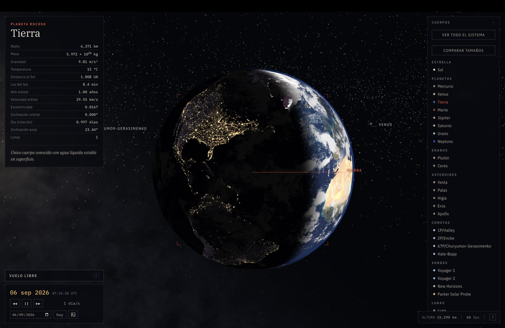
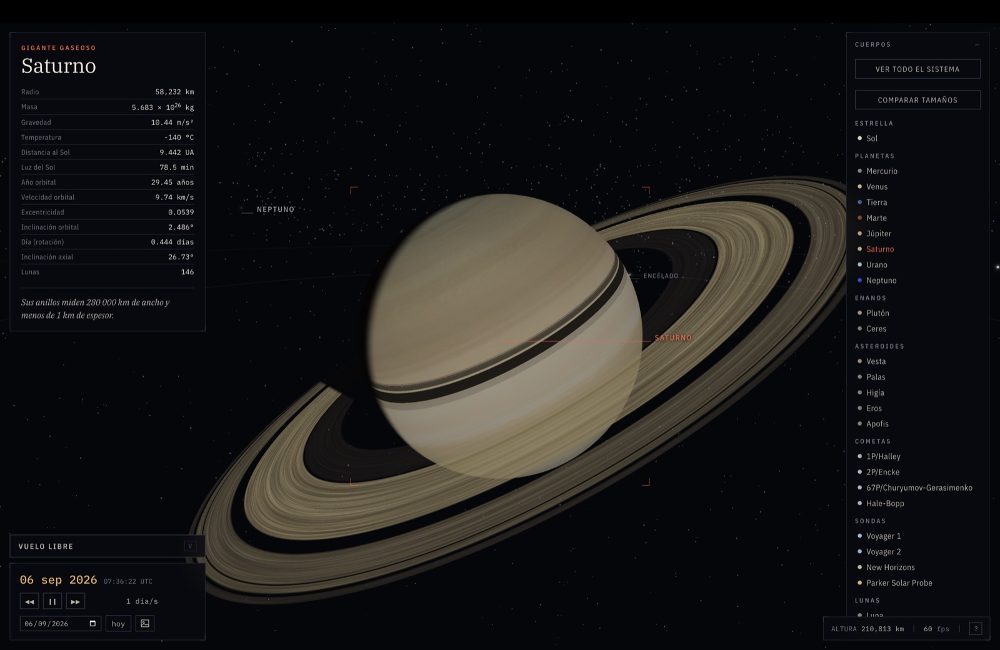
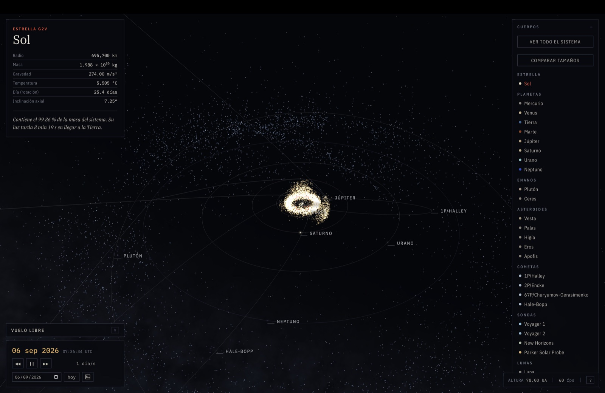
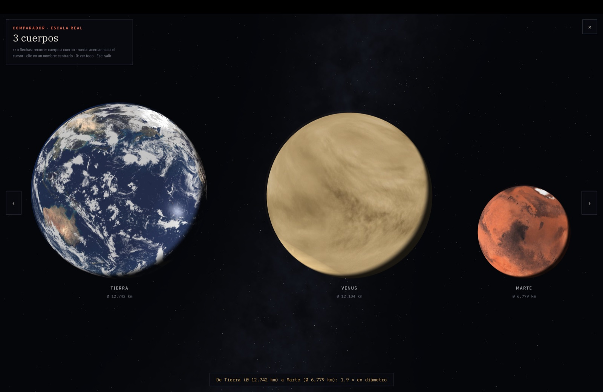
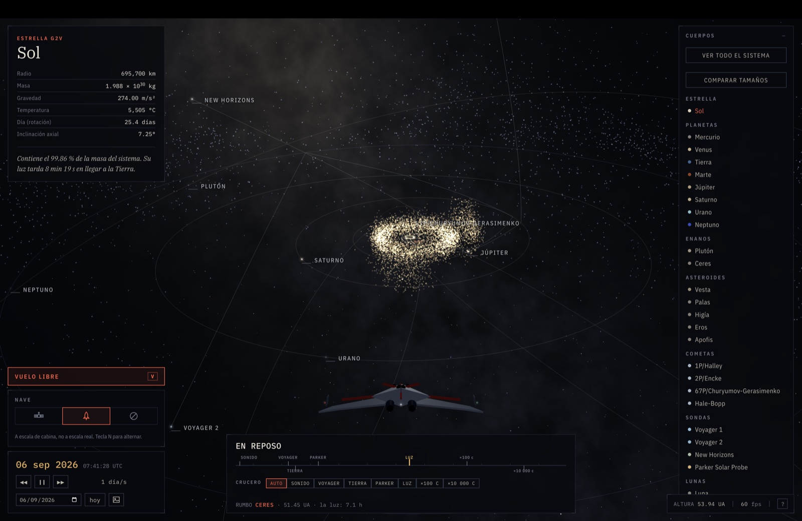
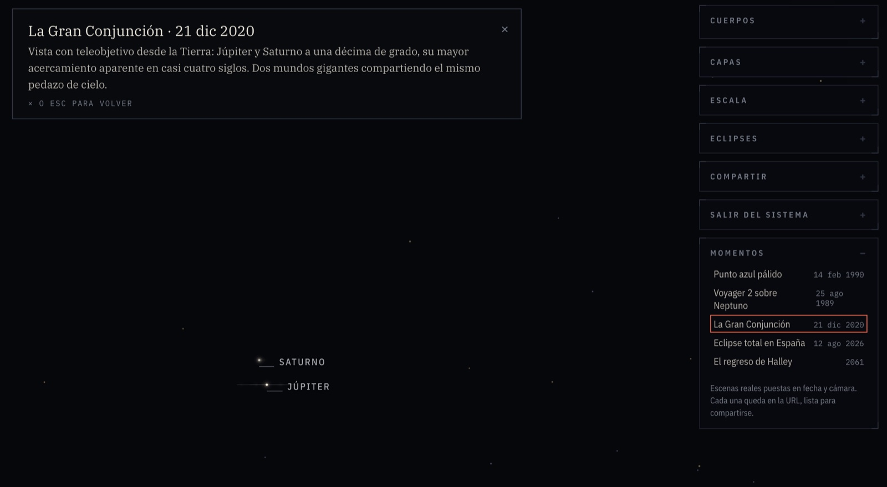

# Sistema Solar a Escala

Simulador 3D del sistema solar con distancias reales, efemérides del JPL y un cielo
de 8 920 estrellas colocadas a su distancia verdadera. Funciona sin red: todo va
incrustado en un solo archivo. Se instala como app (PWA) y sigue funcionando sin
conexión.

## Galería

|  |  |
|:--:|:--:|
| La Tierra y la Luna desde órbita, a escala real | Saturno: anillos procedurales y sombra propia |

|  |  |
|:--:|:--:|
| El sistema completo desde el norte de la eclíptica (la postal) | El comparador: hasta diez cuerpos lado a lado, el Sol entero |

|  |  |
|:--:|:--:|
| Vuelo libre: nave, velocímetro logarítmico, crucero y rumbo | Un Momento guiado: la Gran Conjunción de 2020 vista desde la Tierra |

Las capturas se toman con el propio simulador (Compartir → *Capturar esta vista*) y
viven en `assets/capturas/` como JPG de 1 600 px; no forman parte del build.

Además del simulador trae una **postal descargable** —la vista cenital del sistema
en cualquier fecha, compuesta en el navegador en 16:9, 9:16 o 1:1, con fase lunar y
dedicatoria opcional— y un **comparador de tamaños** que pone hasta diez cuerpos
lado a lado a escala real, alineados por la base, con su inclinación axial y
rotando; el Sol entra completo a la fila. Ambos reutilizan el motor: no añaden
assets ni peso al archivo.

La sección **Momentos** guarda escenas curadas —el Punto azul pálido, la Voyager 2
sobre Neptuno, la Gran Conjunción de 2020, el eclipse total de 2026, el regreso de
Halley— cada una con su fecha, su cámara puesta con intención y un banner que
explica qué estás viendo hasta que sales. Como toda la vista es estado de la URL,
cada momento se comparte como un enlace. El reloj, además, corre en ambos sentidos:
la escalera de velocidades llega hasta −10 años/s.

Al descender sobre un cuerpo con atmósfera (Tierra, Venus, Marte, Titán) un velo
de dispersión pinta el cielo: azul y bruma de horizonte de día, banda cálida de
crepúsculo hacia el Sol, transparente y estrellado de noche. De cerca, nubes y
suelo se enriquecen con detalle procedural anclado a la superficie. Los cuerpos
menores y las lunas pequeñas tienen formas rocosas irregulares — deterministas
por cuerpo, así que Eros luce siempre el mismo cacahuate — mientras que Ceres e
Higía se quedan redondos porque de verdad lo son.

El **vuelo libre** lleva instrumentos: velocímetro de cinta logarítmica con hitos
reales por el camino (del sonido a la Voyager, la sonda Parker, la luz y miles de
veces más allá), una fila de presets de **crucero** para fijar cualquiera de esos
hitos como velocidad, una línea de contexto que traduce la cifra a algo imaginable,
y el rumbo con tiempo de llegada comparado con el de la luz. Se pilota una **sonda
o una nave** procedurales (cero assets), con propulsores ligados al empuje y luces
de navegación, dibujadas a escala de cabina —lo único del universo que no está a
escala real, y se declara. En el teléfono, un cockpit táctil: pulgar izquierdo
empuja, pulgar derecho apunta.

Y se puede **salir de la galaxia**: la Vía Láctea existe como objeto 3D —220 000
puntos procedurales y deterministas con posición real, bulbo, brazos, regiones HII
y halo, con el Sol a 8.2 kpc del centro en la orientación verdadera— y Andrómeda al
fondo, a 765 kpc, con su inclinación real. Desde dentro se ve como la banda de
siempre; al alejarse más de unos cientos de años luz, la banda pintada cede el paso
a la espiral. No cuesta nada mientras no sales del sistema: se genera en un rato
libre, solo se dibuja lejos del Sol y se recorta sola si los fps caen.

El **sonido** es sintetizado y honesto, sin un solo archivo de audio: solo se oye
el empuje de la propia nave (vibración estructural, siguiendo la rampa real) y la
sonificación de las magnetosferas al acercarse a Sol, Tierra, Júpiter o Saturno.
Viene armado por defecto —despierta con el primer gesto, como exigen los
navegadores— y si se apaga, la elección se recuerda.

Cualquier vista se puede **capturar** como PNG a doble resolución, y en el teléfono
tanto la captura como la postal se **comparten** directo a WhatsApp o Instagram con
la hoja nativa del sistema. Fuera del rango 1800–2050, en el que los elementos del
JPL son fiables, el reloj avisa que la precisión baja.

## Compilar

```bash
node build.mjs          # -> dist/sistema-solar.html  y  publicar/index.html
node generar-sitio.mjs  # -> páginas estáticas, sitemap y robots
```

No hay dependencias: solo Node 18 o superior. `three.js` viene incrustado en el
repositorio, así que no hace falta `npm install`.

`build.mjs` produce dos salidas del mismo código:

| Salida | Qué es | Peso |
|---|---|---|
| `dist/sistema-solar.html` | Fragmento sin `<html>`/`<head>`, para el Artifact. Todo incrustado como data URI porque ahí no se permiten peticiones externas. | 3.2 MB en un archivo |
| `publicar/index.html` | Documento completo con SEO y Open Graph. Texturas y catálogos salen como archivos aparte. | 920 KB + 1.9 MB cacheables |

En la versión del sitio, cada textura y cada catálogo lleva el hash de su contenido en
el nombre (`tierra.ce92853f.jpg`), así que se sirven con `immutable` y caducidad de un
año: la segunda visita no descarga nada. Cambiar una textura cambia su hash y rompe la
caché sola, sin tocar configuración.

Todo el HTML sale en **ASCII puro**: los acentos van escapados, así que no depende de
que el servidor mande la cabecera `charset` correcta.

Las rutas de los assets son absolutas, porque con el rewrite de `/fecha/2026-11-28`
una ruta relativa resolvería a `/fecha/tex/...` y daría 404. El prefijo sale de
`SITIO_URL`: si el sitio vive en un subdirectorio (como en GitHub Pages, que sirve
cada repo bajo `/<repo>/`), las rutas se generan con ese prefijo automáticamente.

```bash
SITIO_URL=https://usuario.github.io/sistema-solar node build.mjs   # base /sistema-solar/
SITIO_URL=https://midominio.com node build.mjs                     # base /
```

El build también escribe `publicar/404.html` como copia del index: GitHub Pages no
admite rewrites, pero sirve `404.html` para rutas inexistentes, así que las rutas
bonitas (`/fecha/...`) funcionan igual.

Y genera la parte PWA: `manifest.webmanifest`, un `sw.js` con el precache exacto de
los assets con hash (navegaciones red-primero, assets caché-primero), y los iconos
`icono-192.png` / `icono-512.png`, que no son archivos del repositorio sino un
Saturno dibujado por código en [iconos.mjs](iconos.mjs) con un codificador PNG
mínimo. El service worker solo se registra en la salida sitio, nunca en el artifact.

## Publicar

El directorio `publicar/` es un sitio estático completo. No necesita servidor de
aplicación ni base de datos.

Antes de generar, fija el dominio real para que las URL canónicas y el sitemap
apunten a donde toca:

```bash
SITIO_URL=https://tudominio.com node generar-sitio.mjs
```

Luego sube `publicar/` a cualquier hosting estático:

```bash
# Netlify
npx netlify deploy --dir=publicar --prod

# Vercel
npx vercel deploy publicar --prod

# Cloudflare Pages
npx wrangler pages deploy publicar

# GitHub Pages: copia el contenido de publicar/ a la rama gh-pages
```

`_redirects` y `_headers` (Netlify y Cloudflare) y `vercel.json` ya traen las reglas de
rewrite para que `/fecha/...` y `/date/...` sirvan la app sin un 404, y las cabeceras de
caché de los assets.

Si tu hosting no lee ninguno de esos archivos, basta con tres reglas:

- `/tex/*` y `/datos/*` → `Cache-Control: public, max-age=31536000, immutable`
- `/fecha/*` y `/date/*` → servir `/index.html` con estado 200 (no redirección)
- `/sw.js` y `/manifest.webmanifest` → `Cache-Control: max-age=0, must-revalidate`

La PWA (instalación y modo sin conexión) requiere HTTPS; en `localhost` funciona
para probar.

## Qué contiene el sitio

| Ruta | Qué es |
|---|---|
| `/` | El simulador |
| `/explorar/` | Índice de eclipses y fichas de cuerpos |
| `/eclipse/<slug>/` | Una página por eclipse, 2026–2040 |
| `/cuerpo/<id>/` | Ficha de cada planeta, asteroide y cometa |
| `/sitemap.xml`, `/robots.txt` | Para buscadores |
| `/manifest.webmanifest`, `/sw.js`, `/icono-*.png` | La PWA: instalación e uso sin conexión |

Las páginas de eclipse no son plantillas rellenadas: la fecha, la hora del máximo, el
tipo y las coordenadas del punto de máximo se calculan resolviendo la geometría de los
conos de sombra. Contrastadas con valores publicados, coinciden dentro de 1–2 minutos
y alrededor de 1 grado.

## URLs compartibles

La dirección refleja la vista y se puede restaurar:

```
/?f=2027-08-02T10:07&foco=saturno&d=400000&yaw=120&pit=25&capas=c,-o&play=0
/fecha/2026-11-28
/date/28-11-2026
```

| Parámetro | Significado |
|---|---|
| `f` | Fecha y hora UTC (`YYYY-MM-DD` o `YYYY-MM-DDTHH:MM`) |
| `foco` | Cuerpo enfocado (`tierra`, `saturno`, `halley`…) |
| `d` | Distancia de la cámara en km |
| `yaw`, `pit` | Orientación de la cámara en grados |
| `esc` | Exageración del tamaño de los cuerpos (1–1000) |
| `vel` | Velocidad del tiempo (−8 a 8; negativo = el reloj corre hacia atrás) |
| `play` | `0` para empezar en pausa |
| `nave` | Vehículo del vuelo libre: `sonda` (por defecto), `nave`, `0` = ninguno |
| `capas` | Lista separada por comas; el prefijo `-` apaga (`c,-o` = constelaciones sí, órbitas no). Letras: `o` órbitas · `e` etiquetas · `m` lunas · `a` asteroides · `k` cinturón de Kuiper · `c` constelaciones · `g` Vía Láctea · `z` luz real |

## Fuentes de datos

- Órbitas planetarias: JPL, *Approximate Positions of the Major Planets* (1800–2050)
- Cuerpos menores: JPL Small-Body Database (11 850 asteroides y transneptunianos)
- Sondas: trayectorias reales del JPL Horizons, interpoladas con Catmull-Rom
- Luna: teoría ELP truncada (Meeus, *Astronomical Algorithms*, cap. 47)
- Estrellas: catálogo HYG v4.1, magnitud ≤ 6.5
- Constelaciones: d3-celestial de Olaf Frohn (BSD-3)
- Mapas de superficie: NASA Blue Marble y Visible Earth; Solar System Scope (CC BY 4.0)
- Three.js r169 (MIT), incrustado

Las licencias y la atribución completa están en [CREDITOS.md](CREDITOS.md).
**Importante**: `stars.json` deriva del catálogo HYG, que es CC BY-SA 4.0, así que
ese archivo arrastra la cláusula ShareAlike aunque el resto del código no.

## Publicar en GitHub Pages

El repositorio trae un workflow (`.github/workflows/deploy.yml`) que compila y
publica en cada push a `main`. Para activarlo: **Settings → Pages → Source:
GitHub Actions**. Si usas dominio propio, define la variable de repositorio
`SITIO_URL` (Settings → Secrets and variables → Actions → Variables) con la URL
completa, para que las canónicas y el sitemap apunten ahí.

## Licencia

El código de este proyecto está bajo **[AGPL-3.0](LICENSE)**. En corto: puedes
usarlo, estudiarlo y modificarlo libremente, pero si lo despliegas como servicio
web —modificado o no— tienes que ofrecer el código fuente a quien lo use.

Los datos y las imágenes de terceros conservan su propia licencia; la lista
completa está en **[CREDITOS.md](CREDITOS.md)**. Una en particular importa:
`stars.json` deriva del catálogo HYG, que es CC BY-SA 4.0, así que ese archivo
se redistribuye bajo esa licencia y no bajo AGPL.

Si necesitas una licencia distinta para un uso comercial cerrado, escribe.

## Límites conocidos

- Precisión planetaria de minutos de arco, no de segundos (elementos aproximados del JPL).
- Las lunas salvo la Luna usan órbitas circulares, no keplerianas.
- Los cometas se propagan como problema de dos cuerpos: lejos de su época los pasos por
  el perihelio se desvían (Halley da enero de 2062 frente a julio de 2061 real).
- La Vía Láctea es procedural, no fotográfica.
- Las texturas son de 2K: de muy cerca, el detalle de nubes y suelo es procedural,
  no geografía real.
- La nave y la sonda se dibujan a escala de cabina, no a escala real.
- La sonificación de magnetosferas es una traducción sintética, no una grabación.
- Sin conexión funciona el simulador completo; las páginas estáticas
  (`/eclipse/`, `/cuerpo/`) necesitan red.

## Hoja de ruta

Lo que viene, en orden y con su diseño técnico, está en [ROADMAP.md](ROADMAP.md).
